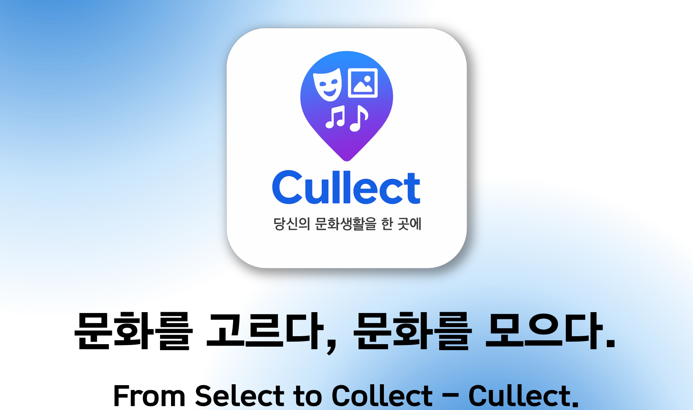
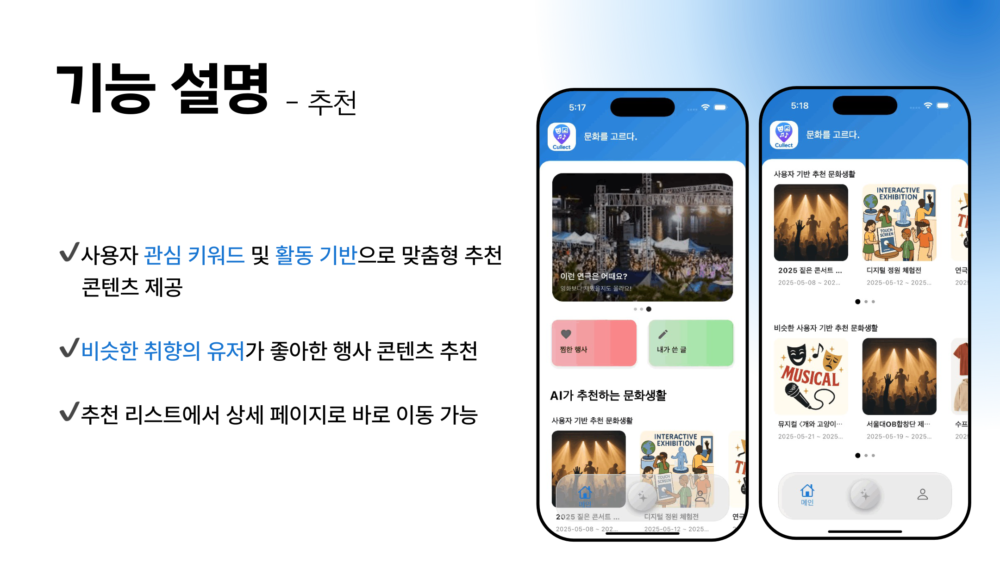
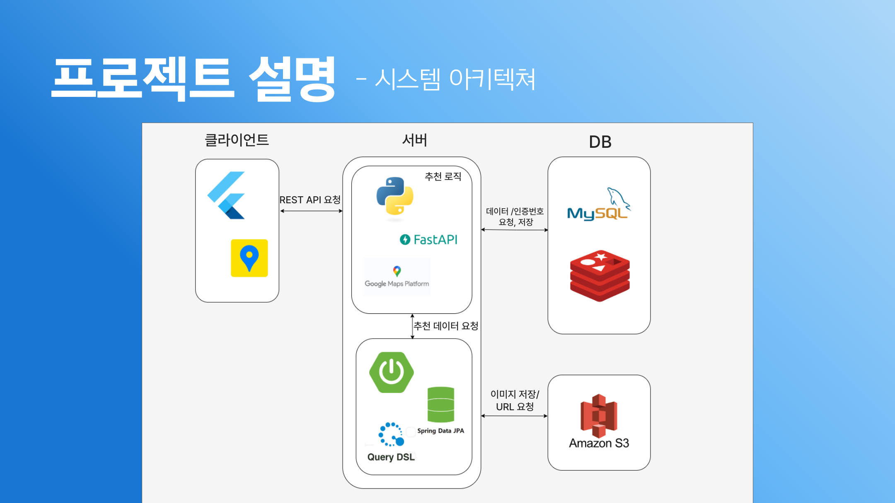
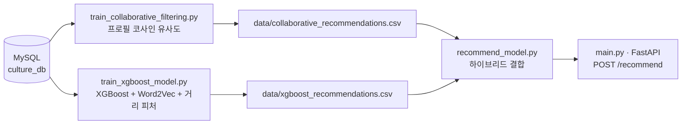

<p align="center">
  
</p>

# Cullect — 문화생활 추천 시스템 (Hybrid Recommendation Engine)

2025 동국대학교 공개SW프로젝트 팀 프로젝트 **"문화생활추천 앱"** 에서 제가 담당한 AI 추천 시스템 부분입니다.
제가 작업한 추천 엔진 코드를 중심으로 구조를 정리했습니다.

> Team project (Dongguk University, Open Source SW Project, 2025): a culture/event recommendation app.
> This repository contains the recommendation engine I built and served via FastAPI.

## 담당 역할 (My Role)

사용자 프로필·행동 로그를 기반으로 문화 콘텐츠(전시, 공연 등)를 추천하는 **하이브리드 추천 시스템**을 설계하고 구현했습니다.

- **Collaborative Filtering**: 사용자 프로필 유사도(코사인 유사도) 기반으로, 취향이 비슷한 사용자들이 찜한 콘텐츠를 추천
- **XGBoost 기반 랭킹 모델**: 사용자 프로필, 지역 거리, 관심 키워드(Word2Vec), 찜 이력의 최신성(time decay)을 피처로 사용해 콘텐츠별 선호 확률을 학습하고, 콘텐츠 텍스트 임베딩 유사도와 결합해 최종 추천 점수 산출
- 두 모델의 추천 결과를 결합하는 **하이브리드 추천 API**를 FastAPI로 서빙
- APScheduler로 매일 새벽 1시 자동 재학습 파이프라인 구성

## 스크린샷 (Screenshots)

<p align="center">
  
</p>

## 아키텍처 (Architecture)

### 전체 시스템 구조

앱은 Flutter 클라이언트, Spring Boot 서버, 그리고 제가 담당한 Python/FastAPI 추천 엔진, MySQL·Redis·S3로 구성됩니다.

<p align="center">
  
</p>

### 이 저장소의 추천 파이프라인



## 기술 스택 (Tech Stack)

- **API**: FastAPI, Uvicorn, APScheduler
- **ML/Data**: scikit-learn, XGBoost, gensim (Word2Vec), pandas, numpy
- **DB**: MySQL (PyMySQL)

## 프로젝트 구조 (Project Structure)

```
src/
  main.py                          # FastAPI 앱 — /recommend, /run-model 엔드포인트, 스케줄러
  recommend_model.py                # 두 모델의 추천 결과를 결합하는 하이브리드 로직
  train_collaborative_filtering.py  # 사용자 프로필 기반 협업 필터링 학습/추천 생성
  train_xgboost_model.py            # XGBoost 하이브리드 랭킹 모델 학습/추천 생성
  db_config.py                      # 환경변수 기반 MySQL 연결 설정
data/
  collaborative_recommendations.csv # 협업 필터링 결과 예시
  xgboost_recommendations.csv       # XGBoost 모델 결과 예시
sql/
  *.sql                              # 팀에서 설계한 DB 스키마 (MySQL dump)
docs/
  발표자료.pdf                       # 팀 최종 발표자료
  images/                            # README에 사용된 이미지
```

## 실행 방법 (Getting Started)

```bash
pip install -r requirements.txt

# 프로젝트 루트에 .env 생성 (.env.example 참고)
cp .env.example .env
# DB_PASSWORD 등 값 채우기

cd src
uvicorn main:app --reload
```

`POST /recommend`  요청 예시:

```json
{ "user_id": 1 }
```

### 참고사항

- Windows 환경에서는 `main.py`의 `subprocess.run(["python", ...])` 호출이, Linux/Mac에서는 `python3`로 바꿔야 할 수 있습니다.
- 학습 스크립트(`train_*.py`)는 MySQL에 연결해 데이터를 로드하므로, DB가 준비되어 있어야 정상 동작합니다. `sql/` 폴더의 스키마로 로컬 DB를 구성할 수 있습니다.

## 발표자료

[docs/발표자료.pdf](docs/발표자료.pdf)

## 팀 프로젝트

이 저장소는 **문화생활추천 앱** 팀 프로젝트에서 제가 담당했던 추천 시스템 부분을 정리한 것입니다.
팀 프로젝트 전체(앱)는 [Cullect-App-Front](https://github.com/woo-rug/Cullect-App-Front) 에서 확인하실 수 있습니다.
